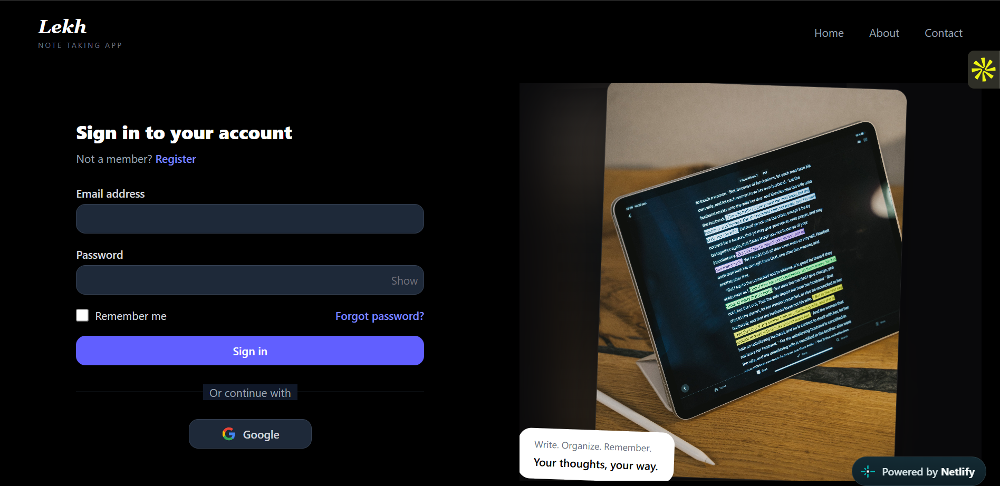

**LEKH - Note Taking App**

Lekh is a real-end collaborative note-taking and whiteboarding web application designed for seamless real-time synchronization, rich document editing, and visual ideation.

Live link - https://lekh-notes.netlify.app/

Frontend Hosted On - Netlify

Backend and Database Hosted On - railway

Create beautiful hand-drawn like diagrams, wireframes, or whatever you like.

**Features-**

1.💯 Free & open-source.

2.🎨 Infinite, canvas.

3.✍️ Hand-drawn like style.

4.🏗️ Customizable.

5.📷 Image support.

6.😀 Shape libraries support.

7.🖼️ Export to PNG.

8.⚒️ Wide range of tools - rectangle, circle, diamond, arrow, line, free-draw, eraser...

9.🔙 Undo / Redo.

10.🔍 Zoom and panning support.

11.🔒 End-to-end encryption.

**12.📡Auto save and sync with your google drive.**

**Quick Start**

1. Create .env in notes_service and add all the required constraints -
   CLIENT_ID,
   CLIENT_SECRET,
   SPRING_DATASOURCE_USERNAME,
   SPRING_DATASOURCE_PASSWORD,
   SPRING_DATASOURCE_URL,
   MY_EMAIL,
   APP_PASSWORD,
   FRONTEND_URL,
   GOOGLE_AUTH_SUCCESS_URL,
   LOCAL

2. Create another .env in frontend and add al the required constraints-
   VITE_BACKEND_API_URL, 
   VITE_GOOGLE_CLIENT_ID,
   VITE_GOOGLE_LOGIN_LINK
   
3. run → npm run dev in frontend directory
4. execute the  NotesServiceApplication file in notes_service

**Contributing**
1. Create a pull request for any bug fix or update.

**Repo Owner**

Anuj Rewar 

Linkedin - https://www.linkedin.com/in/anuj-rewar-450527326/

**Licence**
MIT

